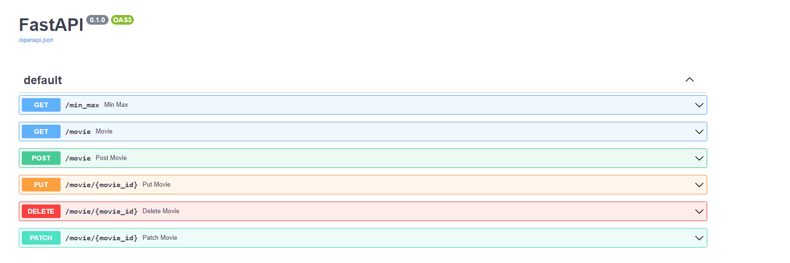

# Filmes e produtores

Esta api inicia carregando uma lista de filmes em memoria, e já deixa calculado o intervalo minimo e maximo entre os ganhadores
Toda vez que é adicionado ou atualizado um filme novo, será recalculado o intervalo minimo e maximo

## 🚀 Começando

Clonar respositorio https://github.com/nicollasborges/movies_producers_winners.git

### 📋 Pré-requisitos

python==3.9.0

fastapi==0.79.1

uvicorn==0.18.2

SQLAlchemy==1.4.40

pytest==7.1.2

requests==2.28.1

httpx==0.23.0

trio==0.21.0

Rodar comando pip install -r requirements.txt

### 🔧 Instalação

Rodar comando python main.py

acessar http://127.0.0.1:8000/docs

## ⚙️ Executando os testes

Testes inicia a criar o db em memória, após isso testa as rotas

Executar comando pytest

## 📦 Desenvolvimento

Adicione notas adicionais sobre como implantar isso em um sistema ativo

## 🛠️ Construído com

FastAPI e SQLAlchemy, dois frameworks muito uteis
 

FastApi para manipular de rotas

SQLAlchemy ORM para manipular db em memória

## ✒️ Autores

* **Nicollas Neumann Borges** [desenvolvedor]https://github.com/nicollasborges)
