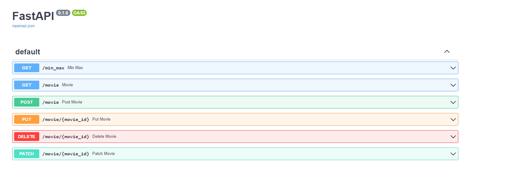

# Filmes e produtores

Esta api inicia carregando uma lista de filmes em memoria, e já deixa calculado a distancia minima e maxima entre os ganhadores
Toda vez que é adicionado ou atualizado um filme novo, será recalculado a distancia minima e maxima

## 🚀 Começando

Clonar respositorio https://github.com/nicollasborges/movies_producers_winners.git

### 📋 Pré-requisitos

fastapi==0.79.1
uvicorn==0.18.2
SQLAlchemy==1.4.40
pytest==7.1.2
requests==2.28.1
httpx==0.23.0
trio==0.21.0

Rodar comando pip install -r requirements.txt

### 🔧 Instalação

Rodar comando python main.py

## ⚙️ Executando os testes

Testes inicia a criar o db em memória, após isso testa as rotas

Executar comando pytest

## 📦 Desenvolvimento

Adicione notas adicionais sobre como implantar isso em um sistema ativo

## 🛠️ Construído com

FastAPI e SQLAlchemy, dois frameworks muito uteis 
FastApi para manipular de rotas
SQLAlchemy ORM para manipular db em memória

## ✒️ Autores

* **Nicollas Neumann Borges** [desenvolvedor]https://github.com/nicollasborges)
